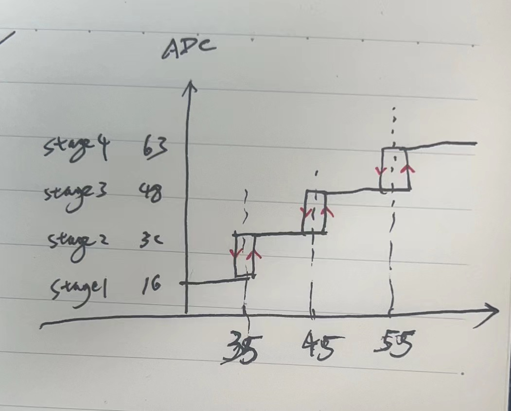

# Use i2c-tools to control i2c fan

```shell
sudo apt install i2c-tools
# set fan ctrl, 4~63
sudo i2cset -y 1 0x4C 0x4C 63
```

## temp contrl



## script
Reference from "https://www.jeffgeerling.com/blog/2021/controlling-pwm-fans-raspberry-pi-cm4-io-boards-emc2301"

## use systemd service
To run fan control script

## generate the deb package

```shell
dpkg-deb -b build-deb fan-ctrl_2.0_arm64.deb

```